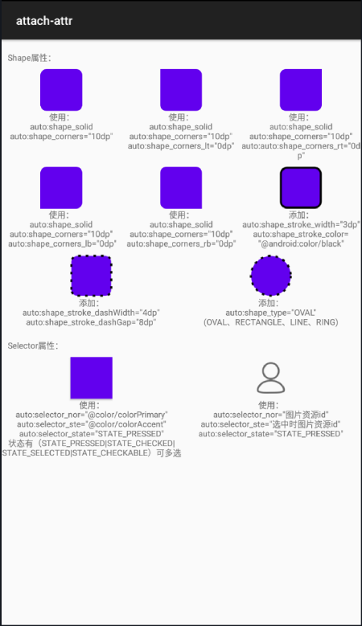

## Android控件属性附加(小工具)
示例图：

### 用法
- 导入
~~~gradle
allprojects {
    repositories {
        ...
        maven { url 'https://www.jitpack.io' }
    }
}

dependencies {
    implementation 'com.github.ray-tianfeng:support-attr:v1.0'
}
~~~
使用 根节点添加
~~~xml
tools:ignore="MissingPrefix"
xmlns:auto="http://schemas.android.com/apk/res-auto"
~~~
控件中使用属性
~~~xml
auto:shape_solid=""
auto:shape_type=""
auto:shape_corners=""
auto:shape_corners_lt=""
auto:shape_corners_rt=""
auto:shape_corners_lb=""
auto:shape_corners_rb=""
auto:shape_stroke_width=""
auto:shape_stroke_dashWidth=""
auto:shape_stroke_color=""
auto:shape_stroke_dashGap=""
auto:selector_state=""
auto:selector_nor=""
auto:selector_ste=""
~~~
因为属性没有指向控件，所以没有代码上的智能提示，需要导入提示模板。  
菜单->File->Settings->Editor->Live Templates->"+"号->Templates
Group->名称填写“Support-attr”  
然后拷贝以下内容到Support-attr下保存就有智能代码提示了
~~~xml
<template name="auto:selector_nor"
value="auto:selector_nor=&quot;$END$&quot;" description=""
toReformat="false" toShortenFQNames="true"> <context>
<option name="XML" value="true" />
<option name="XML_ATTRIBUTE" value="true" />
</context>
</template>
<template name="auto:selector_state" value="auto:selector_state=&quot;$END$&quot;" description="" toReformat="false" toShortenFQNames="true">
<context>
<option name="XML" value="true" />
<option name="XML_ATTRIBUTE" value="true" />
</context>
</template>
<template name="auto:selector_ste" value="auto:selector_ste=&quot;$END$&quot;" description="" toReformat="false" toShortenFQNames="true">
<context>
<option name="XML" value="true" />
<option name="XML_ATTRIBUTE" value="true" />
</context>
</template>
<template name="auto:shape_corners" value="auto:shape_corners=&quot;$END$&quot;" description="" toReformat="false" toShortenFQNames="true">
<context>
<option name="XML" value="true" />
<option name="XML_ATTRIBUTE" value="true" />
</context>
</template>
<template name="auto:shape_corners_lb" value="auto:shape_corners_lb=&quot;$END$&quot;" description="" toReformat="false" toShortenFQNames="true">
<context>
<option name="XML" value="true" />
<option name="XML_ATTRIBUTE" value="true" />
</context>
</template>
<template name="auto:shape_corners_lt" value="auto:shape_corners_lt=&quot;$END$&quot;" description="" toReformat="false" toShortenFQNames="true">
<context>
<option name="XML" value="true" />
<option name="XML_ATTRIBUTE" value="true" />
</context>
</template>
<template name="auto:shape_corners_rb" value="auto:shape_corners_rb=&quot;$END$&quot;" description="" toReformat="false" toShortenFQNames="true">
<context>
<option name="XML" value="true" />
<option name="XML_ATTRIBUTE" value="true" />
</context>
</template>
<template name="auto:shape_corners_rt" value="auto:shape_corners_rt=&quot;$END$&quot;" description="" toReformat="false" toShortenFQNames="true">
<context>
<option name="XML" value="true" />
<option name="XML_ATTRIBUTE" value="true" />
</context>
</template>
<template name="auto:shape_solid" value="auto:shape_solid=&quot;$END$&quot;" description="" toReformat="false" toShortenFQNames="true">
<context>
<option name="XML" value="true" />
<option name="XML_ATTRIBUTE" value="true" />
</context>
</template>
<template name="auto:shape_stroke_color" value="auto:shape_stroke_color=&quot;$END$&quot;" description="" toReformat="false" toShortenFQNames="true">
<context>
<option name="XML" value="true" />
<option name="XML_ATTRIBUTE" value="true" />
</context>
</template>
<template name="auto:shape_stroke_dashGap" value="auto:shape_stroke_dashGap=&quot;$END$&quot;" description="" toReformat="false" toShortenFQNames="true">
<context>
<option name="XML" value="true" />
<option name="XML_ATTRIBUTE" value="true" />
</context>
</template>
<template name="auto:shape_stroke_dashWidth" value="auto:shape_stroke_dashWidth=&quot;$END$&quot;" description="" toReformat="false" toShortenFQNames="true">
<context>
<option name="XML" value="true" />
<option name="XML_ATTRIBUTE" value="true" />
</context>
</template>
<template name="auto:shape_stroke_width" value="auto:shape_stroke_width=&quot;$END$&quot;" description="" toReformat="false" toShortenFQNames="true">
<context>
<option name="XML" value="true" />
<option name="XML_ATTRIBUTE" value="true" />
</context>
</template>
<template name="auto:shape_type" value="auto:shape_type=&quot;$END$&quot;" description="" toReformat="false" toShortenFQNames="true">
<context>
<option name="XML" value="true" />
<option name="XML_ATTRIBUTE" value="true" />
</context>
</template>
~~~
### 原理
通过解析属性，代码生成drawable，设置到对应的view。

### 优缺点
优点：
1. **不需要去加载xml的背景；（性能优化）**
2. 比较简单的图形，可以通过几句代码就可以实现；

缺点：
1. 不能预览
2. 复杂的图形效果需要定义的属性太多
3. 无编译器代码提示支持，只能通过自定义Templates的方式去做代码提示

总结：  
如果平常做开发，可以和原生xml混合使用。简单图形时使用此库，需要复杂图形时自定义xml去实现。

此库最大的有点就是不需要去加载xml文件。任何io都是一种耗时操作，此库提供自定义属性去解决背景创建问题。

